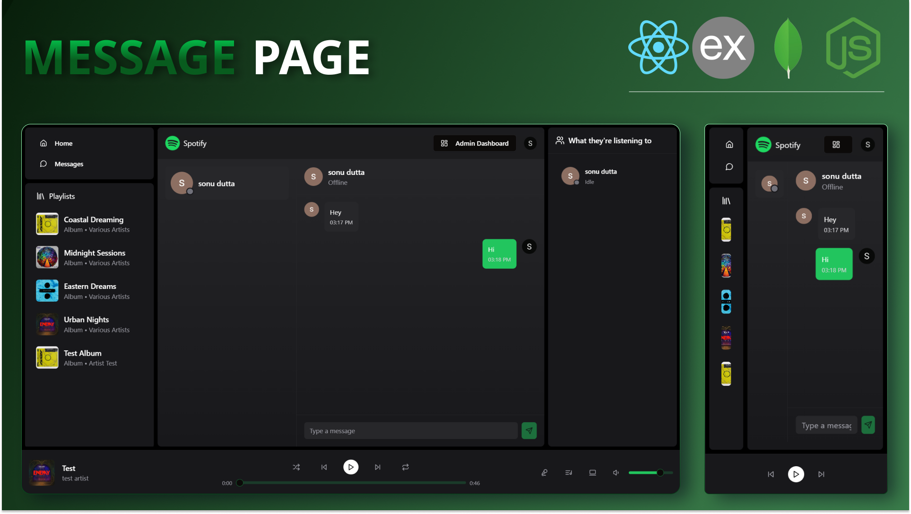

# Spotify Clone Project 🎵🚀

A fully-featured **Spotify Clone** built using **React**, **TypeScript**, **Node.js**, and **Socket.io**. This app lets you experience real-time user activity, chat with friends, and manage songs and albums in an admin dashboard.

---

## 🚀 Features
- **Real-time User Activity:** View users' online status and the music they are listening to.
- **Chat Feature:** Connect with friends in real-time while listening to music.
- **Admin Dashboard:** Add, delete, and manage songs, albums, and user data.

---

### 1. **Homepage**
- Displays a list of songs and albums.
- Users can view the current song playing, their activity status, and interact with other users.
- Allows users to play, pause, or skip tracks.

  <!-- Image with size control -->

### 2. **Album Page**
- Displays all songs in a selected album.
- Shows album artwork, song list, and allows users to play songs from the album.
- Users can like songs or add them to their playlist.

### 3. **Chat Page**
- A real-time messaging feature where users can chat while listening to music.
- Shows active users, and users can start private chats with friends.
- Real-time updates with Socket.io.

### 4. **Admin Dashboard**
- Admin panel to manage songs, albums, and users.
- Add or delete songs and albums from the platform.
- View analytics for users, songs, and albums.
- Manage user accounts and statuses.

